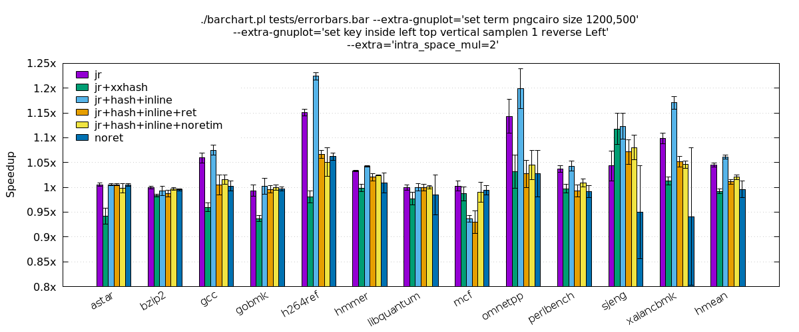
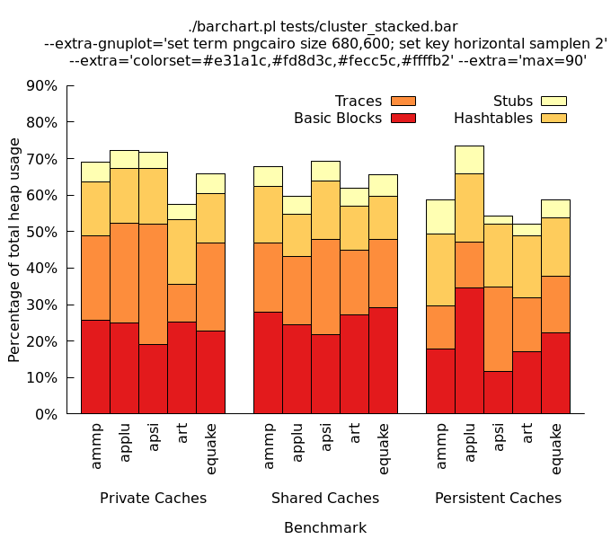
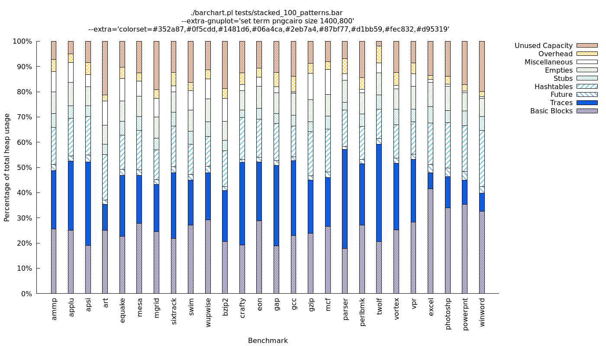

# NAME

    barchart.pl - a simple gnuplot (>= 5.0) front-end for generating bar charts

# SYNOPSIS

    barchart.pl [options] [file]

    File: path to input file, or read input from STDIN.
    Options:
      --extra: extra arguments to pass to the script.
               Multiple --extra=foo arguments are supported.
      --extra-gnuplot: extra arguments to pass straight to gnuplot.
               Multiple --extra-gnuplot=foo arguments are supported.
      -h|--help: show this help message.
      --man: show full documentation (markdown format).

# DESCRIPTION

This is a simple front-end for gnuplot to ease the generation of bar charts.
The script takes an input file with data and commands, and generates output
for gnuplot that includes both data and gnuplot commands.

The syntax of the input file is the almost the same as that of Derek Bruening's
[bargraph](http://http://www.burningcutlery.com/derek/bargraph/). Note,
however, that this script is not a drop-in replacement for bargraph; bargraph
has features such as data processing and legend placement that are unlikely to
ever be supported here. Instead, this script expects you to (1) prepare the
input data with other scripts, and (2) work directly with gnuplot to specify
the final size, aspect ratio and legend of the chart in your chosen terminal.
This can require extra work but it is more flexible than fiddling with fig
output like bargraph does.

This script only works with gnuplot v5.0 or above.

## File Format

The script takes in a single file that specifies the data to chart and control
parameters for customizing the chart. The parameters must precede the data in
the file. Comments can be included in an inputfile following the '#' character.
Empty/whitespace lines are ignored. Leading or trailing whitespace is also
ignored.

### Describing datasets

Either `=table` or `=multi` can be used to describe datasets.

#### `=table`
Indicates that the data will be listed in columns. The table is split by
whitespace. Example:

     =table
     age     37  9 22
     height  17 12 20
     weight  92 52 84

#### `=multi`
When data is not in table format, multiple datasets must be separated by
this marker. Example, equivalent to the `=table` above:

     age    37
     height 17
     weight 92
     =multi
     age     9
     height 12
     weight 52
     =multi
     age    22
     height 20
     weight 84

### Multiple datasets

Multiple datasets can be grouped to generate clustered, stacked or
stacked-clustered bar charts. The grouping is specified by the following
options:

#### `=cluster`
Indicates that there are multiple datasets that should be displayed as
clustered bars. This command also provides the names of the datasets. The
character following `=cluster` is taken as a delimiter separating the rest
of the line into strings naming each dataset. Some examples:

     =cluster;Irish elk;Dodo birds;Coelecanth
     =cluster Monday Tuesday Wednesday Thursday Friday
     =cluster+Fast; slow+Slow; fast

The data itself must either be in table format or each dataset must be
separated by `=multi`.

#### `=stacked`
Just like `=cluster`, this indicates that there are multiple datasets, but
to be displayed as stacked bars rather than clustered bars. The data must
be either in table format or delimited by `=multi`. The names of the datasets
are delimited as with `=cluster`:

     =stacked,Irish elk,Dodo birds,Coelecanth

#### `=stackcluster`
Just like `=cluster`, this indicates that there are multiple datasets, but here
we have an extra dimension and the data is displayed as clusters of stacked
bars. Each cluster is itself like a `=stacked` dataset, and must be either in
table format or delimited by `=multi`. The names of the stacked datasets are
delimited as with `=cluster` and are used in the legend:

     =stackcluster;Basic Blocks;Traces;Hashtables;Stubs

Clusters of stacked bars are separated with `multimulti=`, which optionally can
be used to name each cluster. For example:

     =stackcluster;Basic Blocks;Traces;Hashtables;Stubs
     =table
     multimulti=Private Caches
     ammp             25.635 23.094 14.780 5.543
     applu            25.035 27.375 14.974 4.913
     multimulti=Shared Caches
     ammp             27.863 18.913 15.536 5.404
     applu            24.501 18.657 11.689 4.720
     multimulti=Persistent Caches
     ammp             17.863 11.913 19.536 9.404
     applu            34.501 12.657 18.689 7.720

### Error bars with `=yerrorbars`

The `=yerrorbars` option can be used to specify that vertical error bars are
to be displayed for each datum. This option is not supported with `=stacked` or
`=stackcluster` charts. The error bar data follows this directive, in the same
format as `=table`. Note that non-table-format error bar data is not supported.

### Control parameters

#### Simple parameters

These are boolean parameters that do not require an argument.

* `=gridx`: Enables printing of the grid lines for the X axis.

* `=nogridy`: Disables printing of grid lines for the Y axis.

* `=nolegend`: Disables the chart's legend.

* `=norotate`: Disables rotation of x tic mark labels. By default, they are
  vertical.

* `=noupperright`: Disables the top and right borders of the chart.

* `=noxlabels`: Disables labels for the X-axis' tics.

* `=patterns`: Specifies that pattern fills rather than solid colors should be
  used to fill the bars.

#### Parameters with values

* `barwidth=foo`: Sets the width of each bar. The default value is 1.

* `colorset=foo`: Sets the colors to use via RGB hex values. Colors should be
  separated by commas and listed in order. If there are less colors than
  datasets, colors from the colorset are repeated.

* `column=foo`: Specifies which column contains the numbers of interest,
  thereby ignoring values in other columns. The column numbers begin at 1,
  which is assumed to always be the benchmark name. The special token 'last'
  can be used here to indicate the final column.

* `intra_space_mul=foo`: Controls the amount of space between bars or clusters
  of bars for a clustered chart. Note that this parameter does not apply to the
  spacing between stacked clusters, i.e. those defined with `=stackcluster`.

* `logscaley=foo`: Sets a logarithmic scale for the y axis, with the specified
  base.

* `max=foo`: Sets the maximum y value displayed.

* `min=foo`: Sets the minimum y value displayed.

* `multimultilabelshift=foo`: Sets the offset of the `multimulti=` cluster
  titles. Passed straight to gnuplot.

* `rotateby=foo`: Sets the rotation angle (in degrees) of the X-axis' labels.

* `title=foo`: Sets the title of the chart.

* `xlabel=foo`: Sets the X-axis' label.

* `xlabelshift=foo`: Passed straight to gnuplot.

* `yformat=foo`: Specifies the printf-like format for the y tic mark labels.

* `ylabel=foo`: Sets the Y-axis' label.

* `ylabelshift=foo`: Passed straight to gnuplot.

#### Repeatable parameters with values

These parameters can be set several times.

* `extraops=foo`: Specifies a command to pass straight to gnuplot. See also the
  -e command-line argument.

* `horizline=foo`: Draws a horizontal line at the specified y value. Passes
  verbatim any arguments beyond the y value, which is useful to specify the
  style of the line, e.g. "horizline=1 lt -1 lw 2". The default style is "lt
  -1".

## Sample Charts

***

***

# LICENSE

GNU GPL v2 or later.

# AUTHOR

Copyright (C) Emilio G. Cota

Some test input files are adapted from bargraph: Copyright (C) Derek Bruening

# SEE ALSO

* [bargraph](http://www.burningcutlery.com/derek/bargraph)
* [gnuplot](http://www.gnuplot.info)

